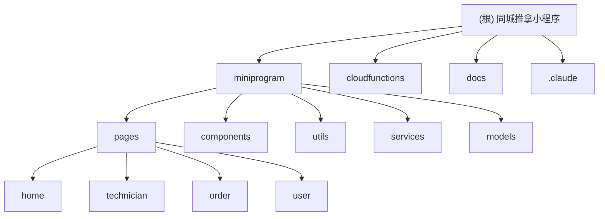

# 同城上门推拿预约微信小程序

## 变更记录 (Changelog)

### 2025-11-18 19:00:15
- 初始化项目架构文档
- 创建模块化结构框架
- 设定开发规范和编码指引

## 项目愿景

为同城用户提供便捷的上门推拿预约服务，通过微信小程序实现技师匹配、预约管理、支付结算等全流程服务。

## 架构总览

### 模块结构图



## 模块索引

| 模块路径 | 类型 | 职责描述 | 状态 |
|---------|------|----------|------|
| `miniprogram/` | 小程序前端 | 用户界面和交互逻辑 | 📝 设计中 |
| `cloudfunctions/` | 云函数后端 | 业务逻辑和数据处理 | 📝 设计中 |
| `docs/` | 文档 | 项目文档和规范 | 📝 设计中 |

## 技术栈

### 前端
- **微信小程序原生框架**
- **TypeScript** (类型安全)
- **Less/SCSS** (样式预处理)

### 后端
- **微信云开发**
- **Node.js** (云函数运行时)
- **MongoDB** (云数据库)

### 开发工具
- **微信开发者工具**
- **ESLint + Prettier** (代码规范)
- **Jest** (单元测试)

## 运行与开发

### 环境要求
- Node.js >= 14.0.0
- 微信开发者工具
- 微信小程序账号

### 开发命令
```bash
# 安装依赖
npm install

# 开发模式
npm run dev

# 代码检查
npm run lint

# 构建
npm run build
```

## 测试策略

### 测试层级
1. **单元测试**: 工具函数、业务逻辑
2. **组件测试**: UI组件渲染和交互
3. **集成测试**: 端到端业务流程
4. **云函数测试**: 后端API测试

### 测试覆盖率目标
- 代码覆盖率 >= 80%
- 关键业务逻辑覆盖率 = 100%

## 编码规范

### TypeScript规范
- 使用严格模式 `strict: true`
- 优先使用 `interface` 定义类型
- 避免使用 `any` 类型

### 命名规范
- 文件名：kebab-case (`user-service.ts`)
- 组件名：PascalCase (`UserCard`)
- 变量名：camelCase (`userName`)
- 常量名：UPPER_SNAKE_CASE (`API_BASE_URL`)

### 代码组织
- 按功能模块组织代码
- 统一使用ES6模块语法
- 保持单一职责原则

## AI 使用指引

### 代码生成指导
1. 优先生成TypeScript类型定义
2. 遵循微信小程序开发规范
3. 注重代码可读性和维护性
4. 添加必要的注释和文档

### 问题解决策略
1. 先查阅现有文档和规范
2. 分析问题的根本原因
3. 提供多种解决方案对比
4. 考虑性能和用户体验

## 核心业务模块

### 用户模块
- 微信授权登录
- 用户信息管理
- 地址管理

### 技师模块
- 技师认证和资质
- 服务项目和价格
- 时间管理和排班

### 预约模块
- 服务项目选择
- 技师匹配算法
- 预约时间管理

### 订单模块
- 订单状态流转
- 支付集成
- 评价系统

### 地图服务
- 位置服务集成
- 距离计算
- 服务范围判断